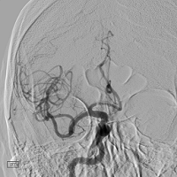
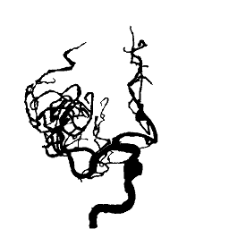

#### CS 188b: Computational Methods for Medical Imaging

# **Final Project: 2D Cerebral Blood Vessel Segmentation**
###           _Sneha Venkatesan, Tanya Lohia_


## Usage
In order to set up a virtual environment with all the necessary dependencies, run the following command: 

```
	conda create -n py2 --name cs188-st --file requirements.txt
```

In order to activate the environment, run: 
```
	source activate cs188-st 
```

In order to run this program, first ensure that the before and after data is in 64x64 format, in folders named "before" and "after" respectively, in your directory with the program files. This program requires both python2 as well as numpy and scipy installed. Images with transparent backgrounds should be formatted likewise so that they are processed by the program. In order to run the program from your current directory, enter the following into the command prompt: 
```
        python2 test_models.py
```

Your output will be a png file showing the expected image, as well as the image predicted by the four models we tested our data on, namely, k-nearest-neighbors, extra trees, linear regression and ridge. 

## Introduction

Strokes are the third leading cause of death in the United States, with over 140,000 people dying every year due to strokes and their complications. In addition, they also lead to brain aneurysms and are the leading cause of serious long term disabiliies. While in the past few years the number of deaths causded by strokes has decreased, they continue to be a challenge for doctors to predict and treat effectively. With increasing population, resources to treat patients who have suffered from a stroke remain insufficient. Fortunately, technological advances, machine learning tools are being used increasingly to assist in this process. Blood vessel segmentation is an example of a process that is extremely time consuming, but can be automated using machine learning techniques. 

Additionally, blood vessel segmentation can assist stroke prevention and aftercare. It is used in numerous medical applications including diagnosis of issues like arteriosclerosis, malfrmations in arteries and veins, tears in arterial linings and predicting lesion growth for ischemic stroke patients. Blood vessel annotation is primarily done using photoshop and can be incredibly labor intensive and time consuming, often causing considerable setbacks to evaluation and treatment. 

Several methods have been developed in an effort to automate this process in order to make it faster and more accessible. Currently, the most popular tools for this purpose are pattern classification and machine learning. Machine learning is becoming increasingly popular for biomedical applications and can serve as useful aids for diagnosis. Our aim with this project is to test several machine learning algorithms to discern which are best in the context of blood vessel segmentation.

## Methods

For the machine learning component we used Python's Scikit-Learn packages, primarily using regression for blood vessel segmentation. The original basis of our code was from a sample face completion project in scikit-learns toolboxes, which predicted the bottom half of faces when the top half was the input data, after the model was trained on multiple images of complete faces. We based our attempt at blood vessel segmentation on this example and adopted it to our requirements. 

Our project data consists of two sets of images which was kindly provided to us by Professor Scalzo. The first set of images were the original cerebral angiography scans of diagnosed patients of ischemic stroke, while the second set consists of annotations of the corresponding angiograms that were illustrated using Photoshop. These images are not published here since they are medical data files.


#### Figure 1: Example of Original Cerebral Angiography Scan (_left_), Example of Corresponding Hand Drawn Annotation (_Right_)

Our method was as follows. First, we needed to process the images as they were in a .png format. We discovered that our machines could not handle processing images larger than 64x64 (our machines crashed when even images of size 128x128 were run), all images were first resized. The angiograms were easily converted into an array of array of pixels. The annotations, due to the presence of a white background, were adjusted for the transparency. These images too were then converted to a 2D array of pixels. We then divided our data into subcategories of train and test, where we train on around 2/3 of the data, and test on the remaining 2/3. 

The model is then fed the training data, with both the original angiogram and the corresponding data. The testing model is then given angiograms, and four regression based algorithms are used to predict the corresponding after image. This after image is compared to the corresponding annotation to evaluate the accuracy of the model. Finally, our program produces a file with a side-by-side comparison of the results of all algorithms, compared to the expected result. 

Below, we describe the four algorithms that we used in this project. The output of these algorithms is also included below, for a side by side comparison of results. These algorithms were selected as they were all standard regression algorithms available in scikit-learn. Since predicting flow growth is a problem that can be solved using regression, these algorithms seemed like the good choice, and we decided to test our data on them. 

1.  **Extra Trees** (Extremely Randomized Trees)
   Extra trees, a type of decision tree algorithm, is an _ensemble learning method_. This means that it uses multiple learning algorithms simultaneously and thus obtains more accurate results than any one algorithm. Extra Trees constructs several decision trees based on the data and finnaly outputs the most occuring one.The _Extra Trees_ algorithm further randomizes top-down splitting in the tree learner, this assists in decreasing variability. Extra trees is a variation of the _Random Forest_ algorithm.
2.  **K-nn** (K-nearest neighbor)
   This is an example of a non-parametric regression algorithm, which means that it is not defined by a bounded set of parameters and uses _instance-based learning_ giving it more freedom in the weights it assigns. The K-nn regression model creates a function  _h(x)_ that solves a linear regression problem with **_K_** points around a given point **_Xq_**.   
3.  **Linear Regression**
   This method borrowed from statistics uses a linear equation such as **y = _B1_ x + _B0_** and tries to optimize the values of **m** and **b** from a given set of values for **x** and **y** so it can minimize error and eventually predict **y** from a              particular value of **x**. It is a parametric regression model, which means that it uses a fixed number of parameters to predict        relationships.
4.  **Ridge Regression**
   This is a variation of the linear regression model that is used most often when the predictor variables are strongly correlated. If no particular **x** produces a satisfying answer in the ordinary least squares linear regression method described above, then        the ridge regression model provides a better fit. It does so by purposefully introducing bias to the value of **_B_** in an attempt to reduce the variability of the estimate.
   
## Evaluation
As our program produces side by side images produced by different algorithms, we visually compared our outputs to the expected image. Considering our data had to be resized to 64x64 due to the computational power limitations of our machines, a lot of detail and resolution was lost in the data preparation process. We also recognize that the low resolution of our rescaled images and limited data set of around 80 paired images do not provide a comprehensive enough base for training a model to produce more accurate results. In the process of evaluation, the questions we considered were as follows. Would the the results would improve with multiple iterations of the experiment, with better resolution and a larger training data set? How would parametric models perform as compared to non-parametric models? What are the implications of the size of the data set? These were some questions that were considered, among others. 

## Results 

Ultimately, only two of the four algorithms proved fairly efficient in learning how to predict drawings from the Cerebral Angiography scans. An example image of the results are as follows:

 
#### Figure 2: Example of Output Results

As is evident in *figure 2* the clearest and most accurate results were produced by the Extra Trees algorithm. The Ridge and Linear Regression algorithms produced similar results in that they were successful in predicting the right base structure but the image is significantly obscure, and there is a lot of noise in the form of shadowy vessels. The K-nn model is slightly clearer but there is still a considerable amount of noise in the background with too many extra vessels. While the Extra Trees model appears to be the most accurate, the exact blood vessels are not conspicuous enough to substitute in for the hand drawn annotations. Overall, we hypothesize that a lot of the noise can be due to a combination of our low resolution images and a limited training data set; additionally, other regression algorithms could have been tested to see if they performed better. 

## Discussion

Part of the reasons for the aforementioned trends could be in the structure of the algorithms themselves. The Linear Regression and Ridge algorithms are both models based on linear regression models which along with being one of the oldest and most studied machine learning algorithms, are also less reliable in situations where the input data has more noise. It assumes that the relationship between the input and output is linear and so it cannot train well for situations where the linearity of the relationship is less pronounced, resulting in a considerable amount of noise in the resulting output. The complex nature of vascularity is not described by a linear relationship, and so this algorithm may not have been the best choice for this project. 

The greatest limiting factor with the K-nn model is the _K_ value chosen. A _K_ value that is too small can cause overfitting where as too large a value can cause underfitting. Nevertheless, it is better suited for this application as it provides more accuracy when the data set itself has a considerable amount of background noise.

The Extra Trees model produced the best results because its algorithm employs the most amount of randomness of the four tested here in the predictions it makes for optimization. It uses multiple inputs, makes random predictions on each and then integrates them to form a combined decision tree like algorithm which is most effective for a model in which the input images are not clear themselves. 

Another considerable limiting factor was the amount of training data provided. There were only a total of 86 pairs of scanned and annotated images to use for training the algorithm. The computational power limitations of our computer was also an issue since the largest sized picture that could be used was 64x64 which does not offer an optimal amount of clarity for an image of vessels, whose structures have many intricacies. 

Further steps for this study would entail obtaining more data to use for training purposes. Other research in the field of blood vessel segmentation has acknowledged the dearth of training data, and we guess that this could definitely have been a shortcoming of our project. Other algorithms could also be sampled which may lead to a more accurate reproduction, such as neural networks like KSOM, or the back-propagation algorithm which does not rely on any specific models and are much more malleable, and would therefore adapt better to the training data. Neural network algorithms can be considered as a _nonlinear regression_ tool, hence providing a more precise learning model for data that is not easily charaterized using one model. Overall, for a first foray into machine learning, we learned a lot, and are definitely interested in refining this to more than the basics that we worked on. 


